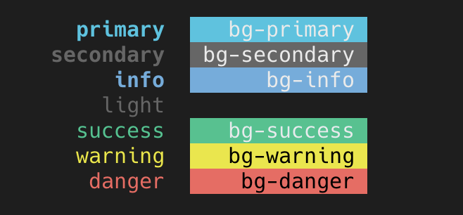

# go-colorize

[](https://godoc.org/github.com/soluble-ai/go-colorize)
[](https://goreportcard.com/report/github.com/soluble-ai/go-colorize)

With:

```go
$ go get github.com/soluble-ai/go-colorize
```

Go from this:

```go
	Colorize("{info:[INFO]} {secondary:%s} {primary:%s}\n",
		time.Now().Format(time.RFC3339), "hello, world")
```

To this:


Default colors are:



Works with https://github.com/kyokomi/emoji and https://github.com/fatih/color.
