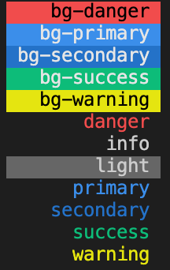

# go-colorize

[](https://godoc.org/github.com/soluble-ai/go-colorize)
[](https://goreportcard.com/report/github.com/soluble-ai/go-colorize)

Go from this:

```go
Colorize("\n{primary:%s} eat {bg-success:pizza :pizza:}{bg-primary: and drink }{warning:beer} %s, but not {bg-danger:%s}\n\n",
		"Most folks like to", ":beer:", "everyone")
```

To this:


Works with https://github.com/kyokomi/emoji and https://github.com/fatih/color.

Default styles are:


